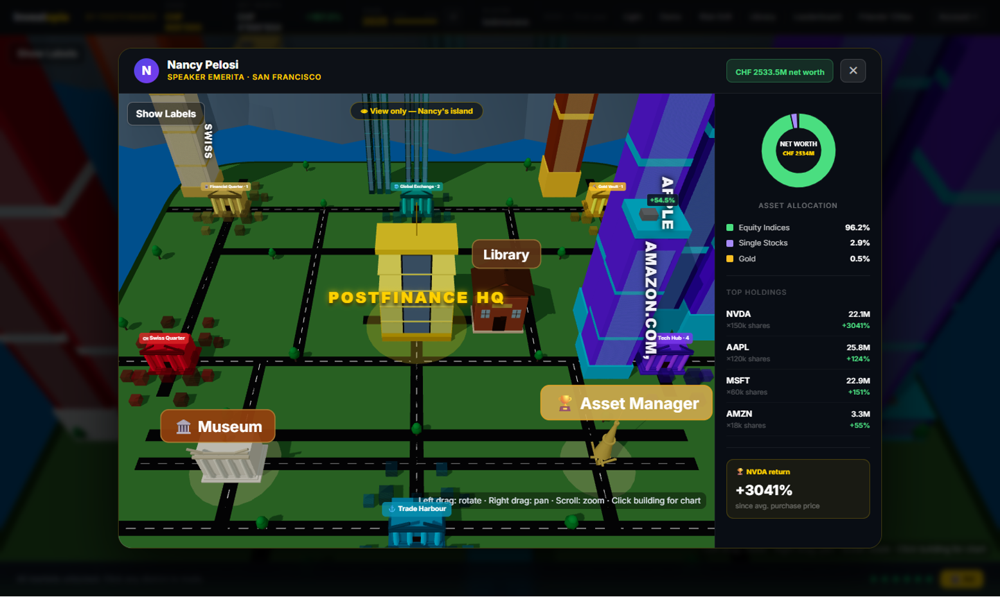

## The Problem

Most adults know they should invest. Most never do.

Not because they lack the money or time, but because investing feels like a world built for other people. The vocabulary is opaque, the stakes feel high, and somewhere along the way the idea took hold that investing is just a sophisticated form of gambling. So people wait. And waiting, compounded over decades, is one of the most expensive financial decisions a person can make.

This was the problem PostFinance put in front of us at START Hack 2026: make investing feel safe to try, engaging to learn, and realistic enough to correct the misconceptions that keep people on the sidelines.

## The Challenge

PostFinance's ask was to build a gamified, playable investment education prototype that teaches beginners the core principles of investing — risk profiling, diversification, asset classes, long-term thinking, handling volatility — without any real money on the line.

The goal wasn't to build a trading app, but to was to build something that changes how a young public (aged 14-30) feels about investing before they ever open a brokerage account and learns them the fundamentals of finance.

## The Team

We were four students from the University of St. Gallen, all connected through the Data Science Fundamentals program. As economics and business students, this was our first hackathon. We didn't really know what to expect - but it turned out to be 36 hours of very little sleep, a lot of laughter, and one of the best team experiences we've had at uni so far.

## Our Solution: Investopia

Have you ever played a city-building game? What did you like about it? For most people, the answer is the same: you build something, and you watch it grow before your very eyes. Progress is visible, effort has a shape.

That's exactly why we built Investopia; a city-building investment simulation where learning is the price of entry, and your portfolio is your city.

The core idea is simple: one asset class, one district. Equities, bonds, commodities, ETFs, crypto: each has its own district, centered around its exchange. Every asset you purchase shows up as a building. Good returns make your buildings grow taller. A thriving, diversified portfolio gives you a thriving, growing city.

Want tall buildings? Get good returns. Want to keep them? Make sure you're diversified.

We took something intangible and made it visible, and that's the whole game.

## How It Works

**The Library** is where you start. Education is at the core of Investopia: before you can trade anything, you need to learn about it. Each module covers one asset class with short, clear explanations, followed by a quiz. Pass the quiz, unlock the district. You also earn badges along the way, displayed in your personal museum.

**The Market** lets you buy and sell assets within your unlocked districts. Prices evolve across a simulated timeline, giving you a real feel for how different asset classes behave over time.

**The Sandbox** lets you explore your portfolio allocations using real market data from 2007 onwards, all visualized as a city. It's designed to highlight what people most often overlook: the long-term benefits of staying invested and the quiet power of compounding.

**The Fire Drill** is our favorite feature. At any point, a financial crisis can strike and the assets that burn are determined by how diversified your portfolio is. The less diversified, the more you lose.

**Friends & Allocations** - because learning is better together. You can connect with friends and peek into their cities, or follow the portfolios of well-known investors. Watch their buildings shake when they go all-in on a single stock.
{fig-align="center" width="300"}

**Battle Mode** lets you compete head-to-head with a friend's portfolio in an accelerated simulation. But be careful: chasing high short-term returns at high risk won't be rewarded in the ranking. Your tallest buildings might burn.

**The Leaderboard and streaks** keep it competitive and habit-forming, two things that matter a lot when your audience has never opened a finance book.

\[Demo video\]

## How We Built It - In 36 Hours

We vibe-coded the entire thing. React on the frontend, Firebase as the backend, and Claude Code doing a lot of the heavy lifting on implementation. One of us would be deep in feature development while the others were working on the pitch deck, refining the game design, or stress-testing the flow as a first-time user. Then we'd rotate, everyone touched everything.

By the end of those 36 hours, we walked into the presentation room ready to pitch, and proud of what we'd built.

## What I Learned

1. Shipping fast
2. Teamwork
3. Pitch

## What We'd Build Next

Investopia is a prototype, and there's a clear path to making it much more:

-   A UI closer to PostFinance's e-trading app
-   Deeper quiz content and more nuanced asset classes, including digital assets
-   An integrated LLM investment coach to guide users through decisions
-   Stop-loss mechanisms and more advanced trading features
-   Income and expense simulation
-   Mobile-friendly design

## A Final Word

Investopia won't make you a millionaire. But it might make you start.

And starting, it turns out, is most of the battle.

## Acknowledgements

This project was completed as part of the [START Hack](https://www.startglobal.org) 2026 in St. Gallen. I warmly thank my group members - [Antonin Ricard-Boual](https://www.linkedin.com/in/antonin-ricard-boual-572715327/), [Andriy Svidrun](https://www.linkedin.com/in/andriy-svidrun/), [Peter Thürbach](https://www.linkedin.com/in/thürbach/) - for their collaboration throughout the project. 

