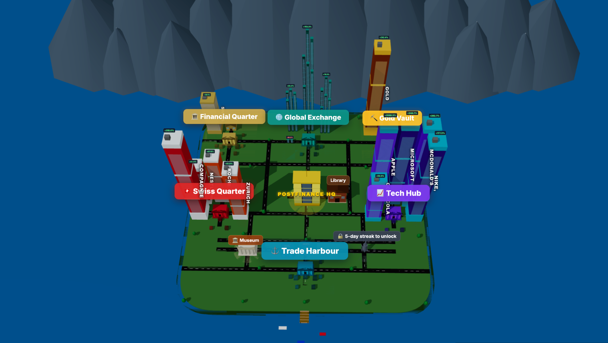

## The Problem

Most people know they should invest, yet very few actually start.

Not because they lack money or time, but because investing feels inaccessible. The language is confusing, the perceived risk is high, and for many it still looks like gambling. Ironically, not investing, waiting, compounded over decades, can be one of the most expensive financial decisions.

This was the problem PostFinance put in front of us at START Hack 2026: make investing feel safe to try, engaging to learn, and realistic enough to correct the misconceptions that keep people on the sidelines.

## The Challenge

PostFinance's ask was to build a gamified, playable investment education prototype that teaches beginners the core principles of investing — risk profiling, diversification, asset classes, long-term thinking, handling volatility — without any real money on the line

The goal wasn’t to build a trading app, but something that changes how young people (14–30) feel about investing before they ever open a brokerage account.

## The Team

We were four students from the University of St. Gallen, all connected through the Data Science Fundamentals program. As economics and business students, this was our first hackathon. We didn't really know what to expect - but it turned out to be 36 hours of very little sleep, a lot of laughter, and one of the best team experiences we've had at uni so far.
{fig-align="center" width="600"}

## Our Solution: Investopia

We kept coming back to one question: how do you make something abstract feel tangible?

Have you ever played a city-building game? What did you like about it? For most people, the answer is the same: you build something, and you watch it grow before your very eyes. Progress is visible, effort has a shape.

That’s exactly the idea behind Investopia: a city-building investment simulation where learning is the price of entry, and your portfolio is your city.

The core idea is simple: one asset class, one district. Equities, bonds, commodities, ETFs, crypto: each has its own district, centered around its exchange. Every asset you purchase shows up as a building. Good returns make your buildings grow taller. A thriving, diversified portfolio gives you a thriving, growing city.

In one sentence: Investopia turns investing into a visual system where decisions directly shape a city, making abstract concepts immediately visible.

Want tall buildings? Get good returns. Want to keep them? Make sure you're diversified.

We took something intangible and made it visible, and that's the whole game.

## How It Works

The experience is built around a simple loop: learn → invest → observe → adapt and refine strategy.

**The Library** is where you start. Education is at the core of Investopia: before you can trade anything, you need to learn about it. Each module covers one asset class with short, clear explanations, followed by a quiz. Pass the quiz, unlock the district. You also earn badges along the way, displayed in your personal museum.

**The Market** lets you buy and sell assets within your unlocked districts. Prices evolve across a simulated timeline, giving you a real feel for how different asset classes behave over time.

**The Sandbox** lets you explore how different portfolio allocations would have actually performed, visualized as a city evolving over time. It's designed to highlight what people most often overlook: the long-term benefits of staying invested and the quiet power of compounding.

**The Fire Drill** is our favorite feature. At any point, a financial crisis can strike and the assets that burn are determined by how diversified your portfolio is. The less diversified, the more you lose.

**Friends & Allocations** - because learning is better together. You can connect with friends and peek into their cities, or follow the portfolios of well-known investors. Watch their buildings shake when they go all-in on a single stock.

**Battle Mode** lets you compete head-to-head with a friend's portfolio in an accelerated simulation. But be careful: chasing high short-term returns at high risk won't be rewarded in the ranking. Your tallest buildings might burn.

**The Leaderboard and streaks** keep it competitive and habit-forming, two things that matter a lot when your audience has never opened a finance book.

Have a look at our demo: 


## Our Stack and Workflow
The frontend is built with React and Vite, styled with Tailwind CSS, and uses Three.js for the 3D city rendering. The backend runs on Firebase (Firestore for real-time data, and Firebase Auth for user accounts). All asset price data is computed client-side from historical datasets embedded in the app.

Given the 36-hour constraint, we leaned heavily on Claude Code as an AI coding assistant. It significantly accelerated implementation, from scaffolding components to debugging tricky state logic. That said, every feature was discussed, designed, and validated by the team before and after it was built.

We worked in short, iterative cycles with fluid roles. At any given point, one of us was coding, another was shaping the pitch narrative, another was testing the game as a first-time user, and the last was tightening the demo flow. We rotated constantly, everyone touched the product, the story, and the presentation.

By the end of those 36 hours, we walked into the room ready to pitch, and proud of what we'd built.

## What I Learned
### 1. Deliver fast, but with focus 
In a 36-hour hackathon, the challenge isn’t a lack of ideas—it’s choosing what not to build. We had many directions we could have explored, but we quickly defined a clear core product and prioritized must-have features over nice-to-haves. Focusing on a simple, working core loop first allowed us to move fast while still leaving room for additional ideas. Under tight time constraints, clarity and decisiveness matter more than completeness.

### 2. Teamwork is the real multiplier
What made the experience work wasn’t just individual contributions, but how well we worked together. We constantly built on each other’s ideas, brainstormed as a group, and leaned into our respective strengths. Roles stayed flexible, and there was a strong sense that we were solving the problem together. That alignment made us both faster and more consistent, and it made the whole experience a lot more fun.

### 3. A great pitch makes the product click
With only three minutes, every second counts. We focused on being clear, punchy, and structured—framing our presentation so it felt like a direct answer to PostFinance’s problem. The goal wasn’t just to explain what we built, but to make them feel why it works. Showing the game in action, keeping slides simple, and delivering a memorable message made a huge difference. We treated the pitch as a product in itself, not just a presentation.

## What We'd Build Next
If we were to take Investopia further, we would focus on three directions: realism, personalization, and long-term engagement:

-   A UI closer to PostFinance's e-trading app
-   Deeper quiz content and more nuanced asset classes, including digital assets
-   An integrated LLM investment coach to guide users through decisions
-   Stop-loss mechanisms and more advanced trading features
-   Income and expense simulation
-   Mobile-friendly design

## A Final Word
Investopia won't make you a millionaire. But it might make you start.

And starting, it turns out, is most of the battle.

## Acknowledgements

This project was completed as part of the [START Hack 2026](https://www.startglobal.org), Europe's largest student hackathon, hosted annually in St. Gallen. The challenge was proposed by PostFinance, and we're grateful for the opportunity to have worked on a cause that geniunely interests us.

A warm thank you to my teammates - [Antonin Ricard-Boual](https://www.linkedin.com/in/antonin-ricard-boual-572715327/), [Andriy Svidrun](https://www.linkedin.com/in/andriy-svidrun/), [Peter Thürbach](https://www.linkedin.com/in/thürbach/) - for 36 hours of good ideas and energy.

