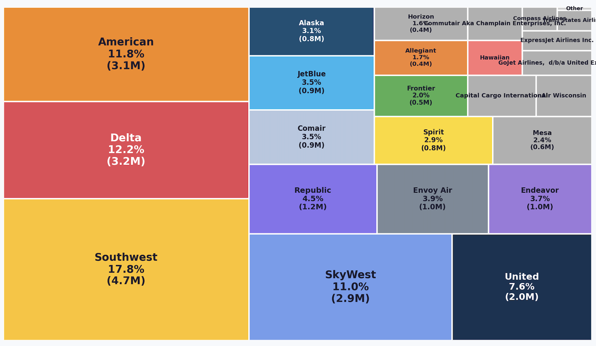
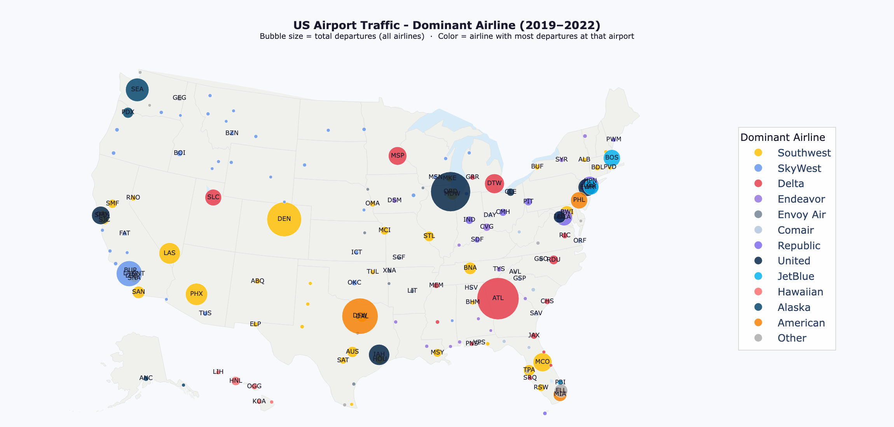
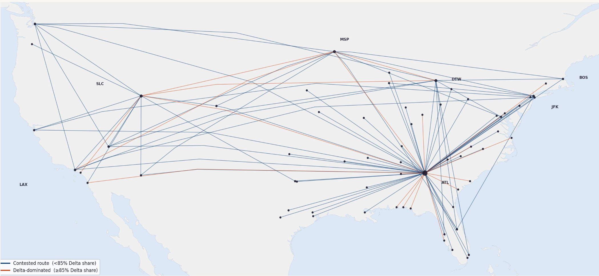
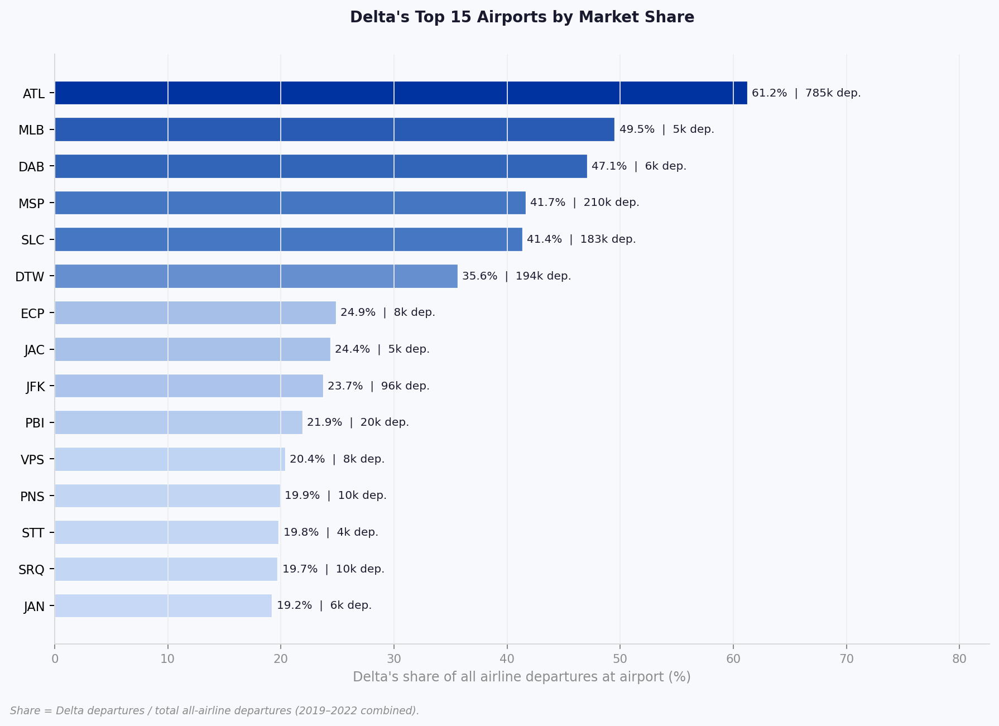
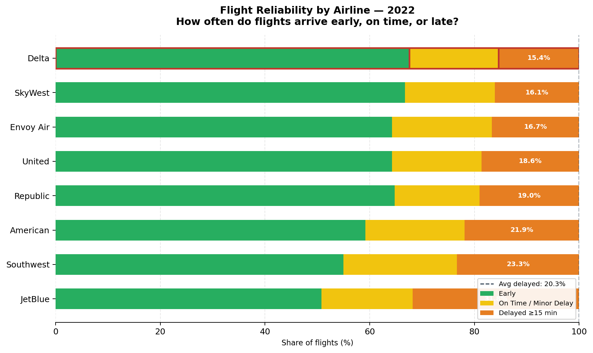
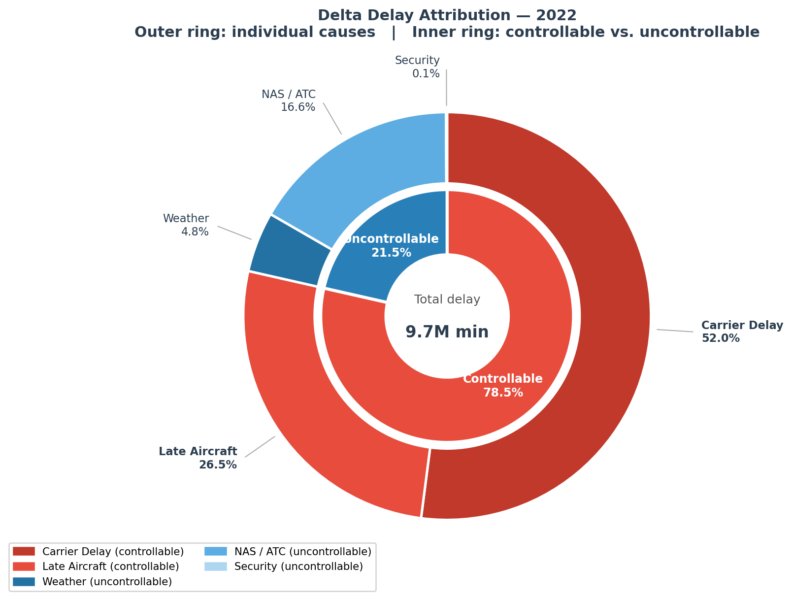
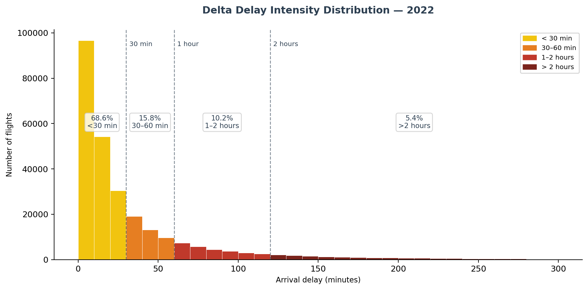
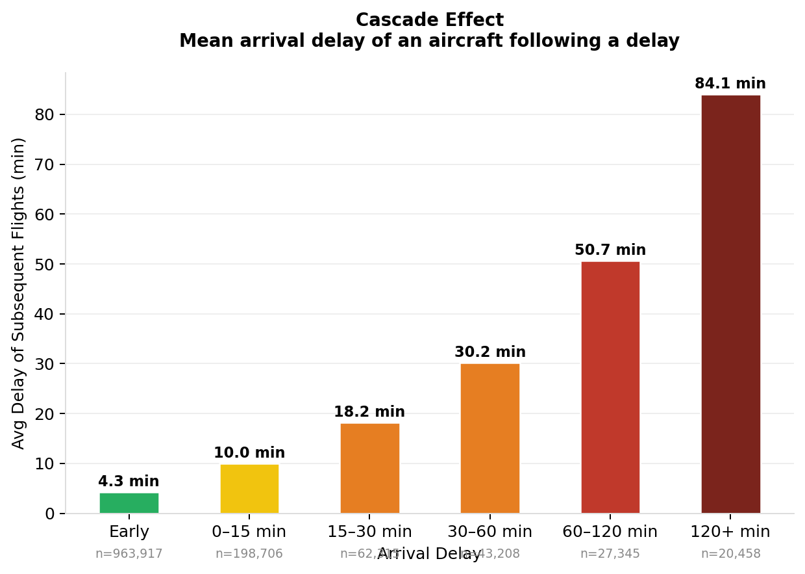
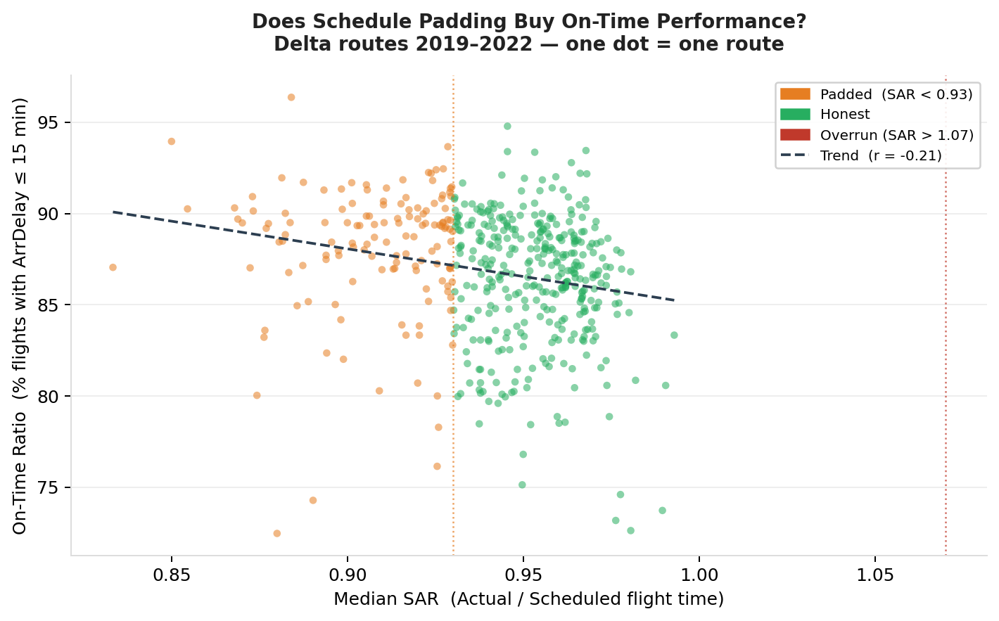
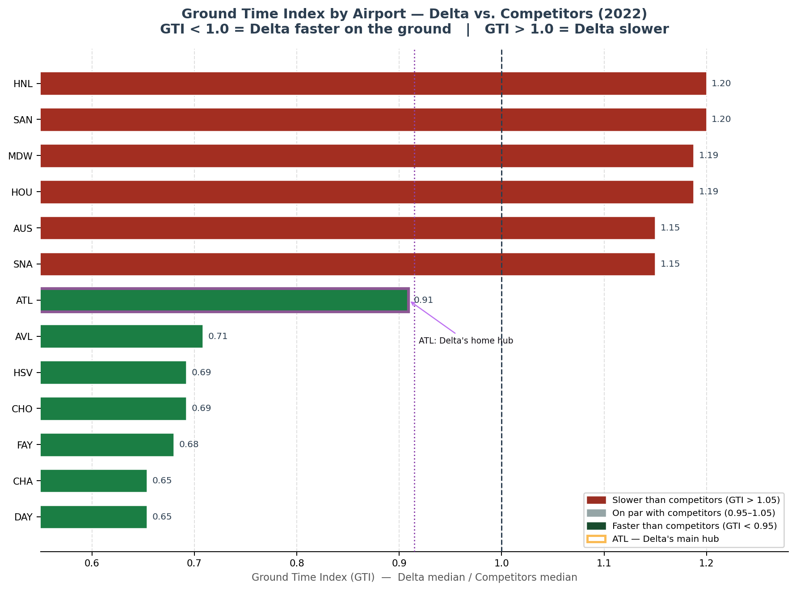

## Introduction

How do you measure whether an airline is actually operating well — not just according to its marketing, but across its full network? That's the question I set out to answer in this project. Using four years of publicly available US domestic flight data, I conducted a deep operational audit of Delta Air Lines: examining delay frequency and causes, schedule honesty, and ground efficiency. The goal was to go beyond a single headline metric and build a composite performance score that could be used to benchmark airlines against one another.

## The Data

The dataset comes from the US Department of Transport's Bureau of Transport Statistics —  "Marketing Carrier On-Time Performance" database, covering 2019 to 2022. It contains 26 million commercial domestic flight records across 21 airlines and 375 airports. For this analysis, I worked with a curated subset of the database of 66 variables, covering the key operational variables: scheduled and actual departure and arrival times, delay causes broken down by category, taxi times, and cancellation flags.

For the analysis, I restricted metrics to operated flights only — cancelled and diverted flights were excluded from delay and elapsed-time calculations. For route-level aggregations, I applied a minimum threshold of 100 flights per route to ensure statistical reliability.

## The US Aviation Market

The US domestic market is dominated by a small number of carriers. Southwest is the largest single airline at 17.8% of all flights, but it operates a point-to-point model with no hubs — which makes it structurally different from legacy carriers when comparing operational metrics. The Big 3 legacy carriers — American, Delta, and United — together account for 35% of domestic flights. It's also worth noting that regional carriers like SkyWest and Endeavour operate largely under Delta's network, meaning Delta's real operational footprint is larger than its headline share suggests.

Geographically, the picture is clear: Delta dominates the Southeast and the Northern corridor, while Southwest controls the West and many secondary cities. These patterns matter: an airline's operational efficiency is shaped by the airports it dominates and the competitors it faces.

## Delta's Strategic Position

Delta operates close to 500 routes. Looking at its top 100 by flight volume, 20 of them are near-monopoly routes where Delta holds more than 85% of departures — concentrated heavily around its hub network.

At the airport level, the concentration is even starker. Delta controls over 60% of all departures at the world's busiest airport, Atlanta (ATL). Outside its hubs, the picture is more competitive: at JFK, for example, Delta's share drops to around 24%. This distinction between Delta's monopoly strongholds and its contested markets will come back in the performance analysis.

## Three Pillars of Operational Efficiency
I structured the audit around three dimensions: **delays, schedule adherence, and ground time**.

### 1 — Delays

#### Frequency

In 2022, 15.4% of Delta flights were delayed by more than 15 minutes, making it the best performer among the Big 3 legacy carriers, and below the industry average of 20.3%. Delta also leads in early arrivals — which is a good result on paper, but raises an immediate question: is this genuine operational excellence, or is Delta simply scheduling more time than routes require? I'll address that in the schedule adherence section.

{fig-align="center" width="610"}

#### Causes

When Delta is late, the causes are mostly self-inflicted. 

{fig-align="center" width="480"}

78.5% of Delta's total delay minutes are controllable — either carrier delays (maintenance, crew, operations) at 52%, or late aircraft delays at 27%. The remaining 21.5% come from external factors like weather or Air Traffic Control.

What's concerning is the trend: Delta's share of controllable delay minutes has risen steadily from 65% in 2019 to 79% in 2022. This is broadly in line with the industry average (around 78%), but the upward trajectory is specific to Delta and worth monitoring.

#### Severity

When delays do occur, most are relatively contained. About 68.6% of delays are under 30 minutes, and the median delay is only 16 minutes. However, the mean is 39 minutes — a significant gap driven by a tail of severe disruptions. 5.4% of delayed flights are over 2 hours. Most passengers experience short delays; a minority experience very long ones.

#### Cascade Effect

One of the more interesting findings concerns how delays propagate through the day. By tracking individual aircraft through their daily schedules, I found that when a flight starts the day 30 to 60 minutes late, subsequent flights on the same aircraft still run an average of 18 minutes behind.

{fig-align="center" width="460"}

This is the cascade effect in numbers: 27% of Delta's total delay minutes are attributed to late aircraft, meaning delays from earlier in the day carry over into later flights. Delays are not isolated events, they're systemic, and a disruption at 7am can still be felt at 9pm across the network.

### 2 — Schedule Adherence

The question of whether Delta's on-time performance is earned or bought comes down to schedule adherence. I measured this using a Schedule Adherence Ratio (SAR) — the ratio of actual block time to scheduled block time. A SAR of 1.0 means the schedule is honest; below 0.93 suggests padding.

Delta's median SAR is 0.94, meaning flights land about 6% earlier than the published schedule. 28% of routes show clear padding, with a median buffer of 8 minutes per flight. On those routes, flights are simply scheduled longer than they need to be.

{fig-align="center" width="500"}

The scatter plot makes the effect visible: padded routes tend to have higher on-time rates, and there's a negative correlation (r = −0.21) between SAR and punctuality. Delta uses schedule inflation as a buffer, and it works. That doesn't mean it's necessarily bad practice — padding is a common industry tool — but it does mean the headline on-time figure overstates pure operational quality to some degree.

### 3 — Ground Time

The final pillar is ground efficiency: how quickly Delta turns its aircraft compared to competitors at the same airports. I built a Ground Time Index (GTI) — the ratio of Delta's median turnaround time (taxi-out + taxi-in) to all airlines' median at the same airport. A GTI below 1.0 means Delta is faster.

Delta's average GTI across all airports is 0.915 — roughly 8.5% faster than the industry average. At ATL, its home hub, the advantage is even sharper: 10% faster than competitors, even at the world's busiest airport. The home advantage is real.

{fig-align="center" width="470"}

There is, however, a notable exception. At airports dominated by Southwest — such as HOU, MDW, or SAN — Delta's GTI exceeds 1.0, meaning it's slower than competitors there. My interpretation is structural: Southwest's entire business model is built around fast ground turns, often at the cost of higher delay rates. At airports where Southwest sets the operational tempo, Delta's turnaround model doesn't translate.

## Toward a Composite Efficiency Score

The next step is to consolidate these metrics into a single comparable score. I designed a composite Efficiency Score combining four components:

| Component | What it captures |
|---|---|
| On-Time Rate | Frequency of failure from the passenger's view |
| Delay Severity | Magnitude when delays do occur |
| Schedule Honesty (SAR) | Whether performance is earned or padded |
| Ground Time Index | Operational execution speed |

Each metric is directionally aligned (higher = better) and normalized across the peer group using min-max scaling. The final score is a weighted average:

Efficiency Score = 0.35 × On-Time Rate + 0.25 × Severity Score + 0.25 × Schedule Honesty + 0.15 × Ground Time Index

The weights reflect passenger impact: punctuality matters most, followed by how bad delays are when they happen and whether the schedule is honest, then ground execution. The framework is modular, components can be adjusted, replaced, or applied at the route level rather than the airline level.

## What's Next

This analysis raises as many questions as it answers. The most compelling extension would be applying the score at the route level, particularly comparing Delta's monopoly routes to its competitive ones. Does Delta relax its operations where it faces no competition?

Other directions worth exploring: 

* the performance contrast between ATL and JFK airports as operationally distinct hubs;
* the role of cancellations and diversions (excluded from this analysis) as potential indicators of systemic issues; 
* the evolution of Delta's network from 2019 to 2022, capturing post-COVID recovery and route restructuring.

### Data source: 
[US Department of Transport, Bureau of Transport Statistics — "Marketing Carrier On-Time Performance" database, 2019–2022](https://www.transtats.bts.gov/Fields.asp?gnoyr_VQ=FGK). All statistics computed from the data.

